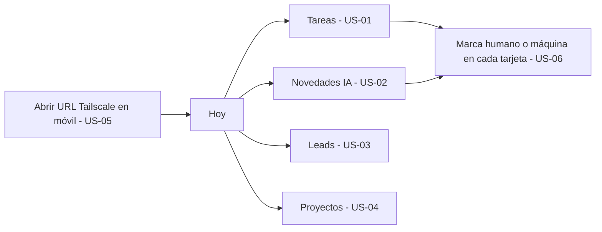

No aplica como documento completo: un solo usuario y 5 pantallas. Flujo mínimo para trazabilidad:

```mermaid
flowchart LR
  A[Abrir URL Tailscale en móvil - US-05] --> H[Hoy]
  H --> T[Tareas - US-01]
  H --> N[Novedades IA - US-02]
  H --> L[Leads - US-03]
  H --> P[Proyectos - US-04]
  T --> M[Marca humano o máquina en cada tarjeta - US-06]
  N --> M
```
